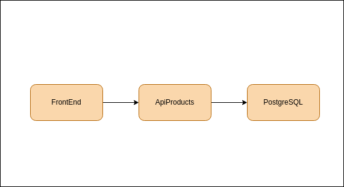

### Objetivos
 - Pipeline CI/CD cloudBuild + GKE.
 - Aplicar Certificados SSL/TLS (Let's Ebcrypt) para https.
 - Aplicar Istio para Service Mesh.
 - Aplicar Prometheus e Grafana.
 - Infra com Terraform usando modulos.


### Repositórios relacionados 
- [Frontend](https://github.com/Adenilson365/devopslabs01-frontend)
- [Terraform - Infra](https://github.com/Adenilson365/devopslabs01-iac)
- [Api - Catalogo](https://github.com/Adenilson365/devopslabs01-catalogo)
### Diagrama de arquitetura


### Documentação
- [cert-manager](https://cert-manager.io/)
- [LetsEncrypt](https://letsencrypt.org/)
- [Ingress Nginx](https://kubernetes.github.io/ingress-nginx/deploy/#gce-gke)
- [Istio - Service Mesh](https://istio.io/)

### Configuração inícial do Cluster
- Execute o terraform ou crie um cluster GKE [Repositório de IAC](https://github.com/Adenilson365/devopslabs01-iac)
- Instale a CNI ingress-nginx
- Instale a CLI do Istio 
- Aplique os arquivos de configuração 
  - Secrets
  - ConfigMaps
  - Ingress Controller
  - PersistentVolumeClaim

### Como Configurar HTTPS
- Instale o cert-manager seguindo a documentação cert-manager.
- Crie o kind ClusterIssuer seguindo: [Documentação](https://cert-manager.io/docs/tutorials/acme/nginx-ingress/)
- Adicione as configurações de Annotations e spec.tls, ainda seguin a documentação do passo anterior
```YAML
apiVersion: networking.k8s.io/v1
kind: Ingress
metadata:
  name: devopslabs
  annotations:
   cert-manager.io/cluster-issuer: letsencrypt-prod
spec:
  ingressClassName: nginx
  tls:
    - hosts:
        - meudominio.com.br
      secretName: letsencrypt-prod
```
- Pronto - HTTPS configurado.

### Intalar Istio
- [LINK](https://istio.io/latest/docs/ambient/install/platform-prerequisites/) - Aplique a configuração específica para o Kubernetes, neste projeto GKE.
- [LINK](https://istio.io/latest/docs/ambient/install/helm/) - Instale os componentes base do Istio via Helm
- [LINK](https://istio.io/latest/docs/ops/integrations/kiali/#installation) - Instale o kiali dashboard
- [LINK](https://istio.io/latest/docs/ops/integrations/grafana/) - Instale o componente Grafana
- [LINK](https://istio.io/latest/docs/ops/integrations/prometheus/) - Instale o componente Prometheus
- [LINK](https://istio.io/latest/docs/ops/integrations/jaeger/#installation) - Para Tracing instale o Jaeger

- Após instalar os componentes injete a label no namespace da aplicação.
  - Novos pods terão sidecar de proxy do istio, pods existentes precisarão ser recriados.
```
kubectl label namespace <NomeNamespace> istio-injection=enabled
```


```shell
#Kubectl Grafana
kubectl apply -f https://raw.githubusercontent.com/istio/istio/release-1.24/samples/addons/grafana.yaml
#Kubectl Prometheus
kubectl apply -f https://raw.githubusercontent.com/istio/istio/release-1.24/samples/addons/prometheus.yaml
#Kubectl Jaeger-Tracing
kubectl apply -f https://raw.githubusercontent.com/istio/istio/release-1.24/samples/addons/jaeger.yaml

```

### Variáveis de ambiente
- Secrets 
```YAML
apiVersion: v1 
kind: Secret
metadata:
  name: db-secret
type: Opaque
data:
  POSTGRES_USER: valor
  POSTGRES_PASSWORD: valor
  POSTGRES_DB: valor
---
apiVersion: v1
kind: Secret
metadata:
  name: catalogo-secret
type: Opaque
data:
  DB_HOST: valor
  DB_USER: valor
  DB_PASSWORD: valor
  DB_DATABASE: valor
```
```shell
#Como colocar em base64 para o secret
echo -d 'valor' | base64 
```


### Scripts úteis

- Criar e popular tabela no banco de dados.

```SQL
CREATE TABLE Products (
    id SERIAL PRIMARY KEY, 
    name VARCHAR(255) NOT NULL,
    price FLOAT NOT NULL, 
    created_at TIMESTAMP NOT NULL DEFAULT NOW(), 
    updated_at TIMESTAMP NOT NULL DEFAULT NOW() 
);

INSERT INTO Products (name, price, created_at, updated_at)
VALUES 
  ('Notebook Dell Inspiron', 3999.99, NOW(), NOW()),
  ('Smartphone Samsung Galaxy S21', 2999.90, NOW(), NOW()),
  ('Fone de Ouvido Bluetooth JBL', 199.99, NOW(), NOW()),
  ('Monitor LG UltraWide', 1299.99, NOW(), NOW()),
  ('Teclado Mecânico Razer BlackWidow', 499.90, NOW(), NOW()),
  ('Mouse Logitech MX Master 3', 399.90, NOW(), NOW()),
  ('Câmera Canon EOS Rebel', 3599.99, NOW(), NOW()),
  ('Smartwatch Apple Watch Series 7', 4299.99, NOW(), NOW()),
  ('Tablet iPad Air 2022', 5299.00, NOW(), NOW()),
  ('Impressora HP LaserJet Pro', 849.90, NOW(), NOW()),
  ('TV Smart LG OLED 55"', 7999.99, NOW(), NOW()),
  ('Console Sony PlayStation 5', 4999.99, NOW(), NOW()),
  ('Caixa de Som Alexa Echo Dot', 349.99, NOW(), NOW()),
  ('Kindle Paperwhite 8GB', 699.90, NOW(), NOW()),
  ('Ar-Condicionado Split LG Dual Inverter', 2699.90, NOW(), NOW()),
  ('Geladeira Brastemp Frost Free', 5299.00, NOW(), NOW()),
  ('Máquina de Lavar Samsung EcoBubble', 2899.99, NOW(), NOW()),
  ('Micro-ondas Electrolux 20L', 599.99, NOW(), NOW()),
  ('Fogão 5 Bocas Brastemp', 1799.90, NOW(), NOW()),
  ('Ventilador Arno Turbo Silencio', 219.90, NOW(), NOW()),
  ('Drone DJI Mavic Mini 2', 3499.99, NOW(), NOW()),
  ('Caixa Térmica Coleman 48QT', 299.90, NOW(), NOW()),
  ('Bicicleta Caloi Elite Carbon', 9999.99, NOW(), NOW()),
  ('Mochila para Notebook Samsonite', 299.99, NOW(), NOW()),
  ('Relógio Garmin Forerunner 245', 1499.99, NOW(), NOW());

```
